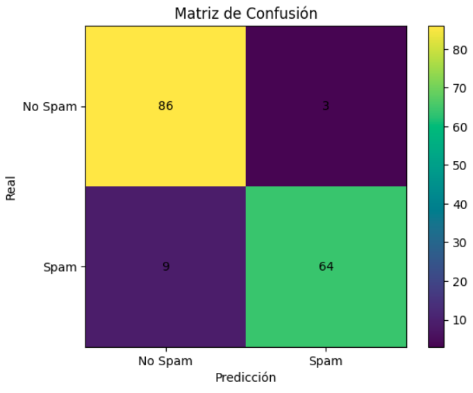
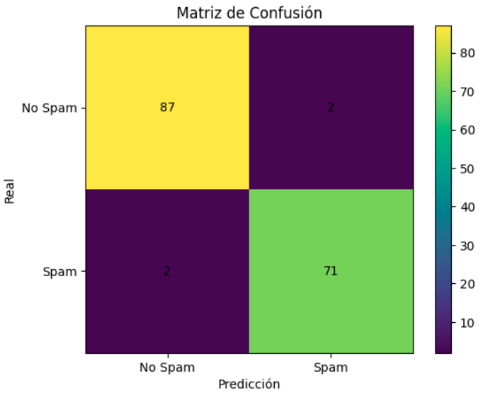
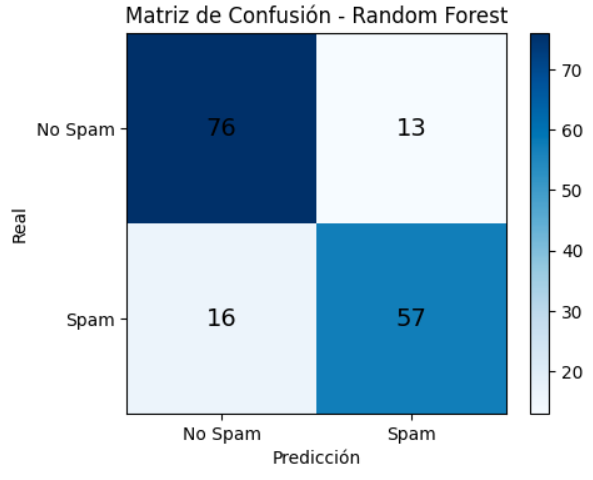
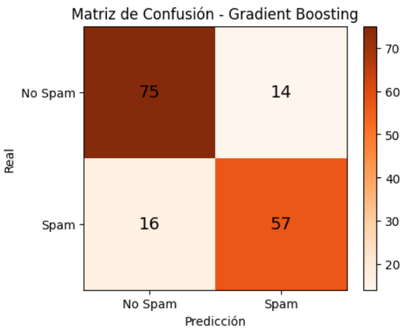
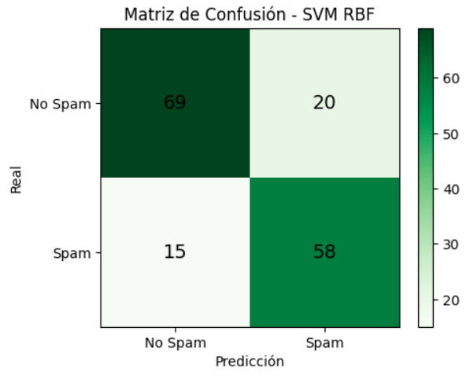
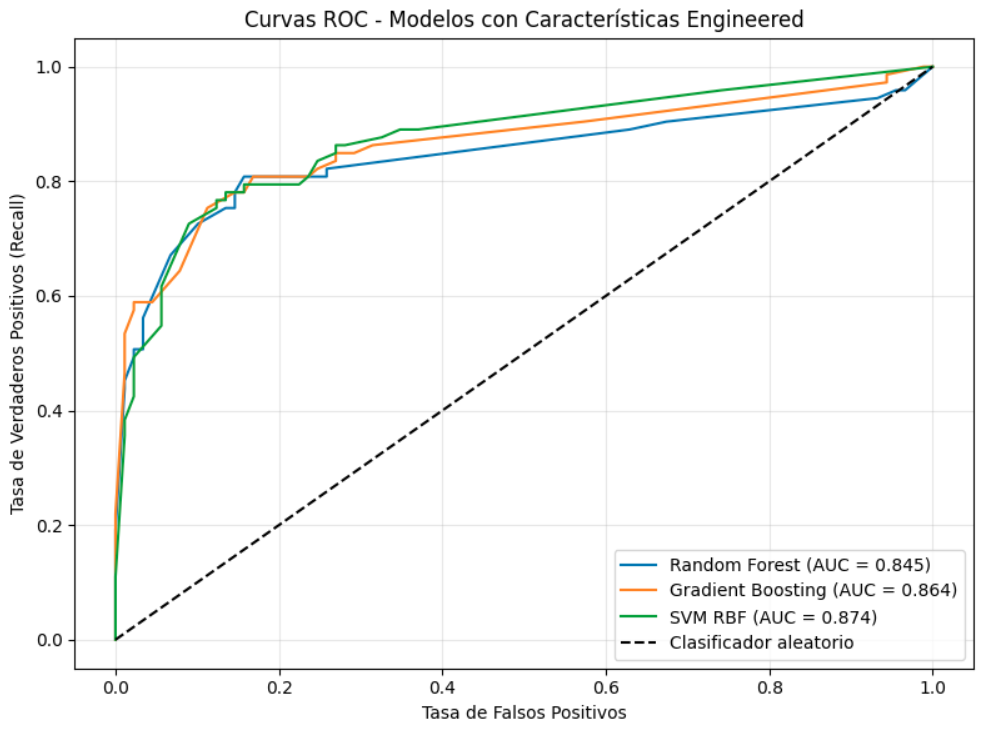

# Fase 2: implementación de modelos de Machine learning

- Pedro Pablo Guzmán Mayen 22111
- Javier Andres Chen Gonzalez 22153

## Introducción

Esta investigación busca el desarrollo de un modelo de aprendizaje automático que sea capaz de identificar si un mensaje SMS en Guatemala es malicioso o no haciendo uso de 3 vectores de ataque: 

- El contenido del mensaje
- El emisor del mensaje
- Metadata asociada al mensaje como presencia de URLs, longitud del mensaje, presencia de palabras de urgencia, etc

Sin embargo, en Guatemala no se ha realizado mucha investigación al respecto y no hay datos oficiales o datasets que tengan registro de los mensajes de texto que tengan una intención maliciosa. Tampoco existen bases de datos que contengan mensajes con información legítima como comprobantes de pago, solicitudes código de verificación, etc. Por esa razón, en este informe se enumeran los procedimientos realizados para generar un dataset que contenga esta información. 

En la fase anterior de esta proyecto, se logró generar con éxito un dataset con 540 muestras de mensajes de texto legítimos e ilegítimos adaptados al contexto guatemalteco, puede ver el dataset aquí: [Dataset_smishing](https://www.kaggle.com/datasets/pedropabloguzmnmayn/smishing-guatemala) y puede aprender más sobre su proceso de creación en esta archivo: [Generación de datos](src/data_generator.ipynb)

## Datos generales del desarrollo de ambos modelos

Como se mencionó anteriormente, se van a analizar 3 vectores de ataque: una lista blanca de números telefónicos conocidos, metadata del mensaje y el contenido en sí del mensaje, por lo tanto, se evaluaron dos enfoques distintos:

Modelos basados en contenido del mensaje — utilizando representaciones textuales (TF-IDF y embeddings).
Modelos basados en características engineered — utilizando señales heurísticas extraídas de cada mensaje.

Todos los modelos se entrenaron con una división 70/30 (entrenamiento/prueba), con estratificación para preservar la proporción de clases, y se optimizaron mediante GridSearchCV con validación cruzada.

## Modelos Basados en Contenido del Mensaje

### Regresión Logística con TF-IDF

Se realizó primero un modelo de regresión logística usando las columnas TF-IDF, la regresión logística es un buen clasificador binario y el SPAM por lo general suele identificarse con bastante éxito con TF-IDF, por esa razón se hizo la elección de este modelo. 

Se uso el siguiente espacio de búsqueda y configuración con gridsearch:

- Optimización: GridSearchCV con CV=15, scoring=f1
- Espacio de búsqueda: $$C ∈ {0.01, 0.1, 0.5, 1, 5, 10, 15}$$, penalidades $$l1/l2$$, solver liblinear

El mejor modelo es uno moderadamente flexible, con regularización suave (C=5), que mantiene todas las variables pero controla el tamaño de los coeficientes (L2), logrando el mejor balance entre precision y recall.

Estos fueron los resltados obtenidos: 

| Clase | Precision | Recall | F1-Score |
|---|---|---|---|
| No Spam | 0.91 | 0.97 | 0.93 |
| Spam | 0.96 | 0.88 | 0.91 |
| **Accuracy** | | | **0.93** |

El modelo en general tuvo un buen rendimiento, identifica con éxito gran parte de los casos, sin embargo detecta de peor forma los mensajes maliciosos, hay al menos un 11% de diferencia entre el recall de la clase no spam y la de spam. 

<div align="center">
  
  <p><em>Figura 1: matriz de confusión del modelo de regresión logística</em></p>
</div>

### Red neuronal con embeddings

Luego, se seleccionó una red neuronal para realizar el modelo usando los embeddings, la arquitectura elegida para el desarrollo de esta red neuronal fue la de multilayer perceptron, esto debido a que es una arquitectura que nos permite capturar patrones y relaciones ocultas en la información, además nuestra información está en forma de vectores densos y no tiene una relación espacial o temporal que debamos capturar. 

Espacio de búsqueda: 
- Capas ocultas: una capa de 64 neuronas; una capa de 128 neuronas; dos capas, una de 128 neuronas y la otra de 64; tres capas, una de 256 neuronas, la siguiente de 128 y la última de 64; una capa de 256 neuronas. 
- Funciones de activación: relu y tanh
- $Regularización: ∈ {1e-4, 1e-3, 1e-2}$, 
- $Learning_rate ∈ {1e-3, 1e-4}$>

El mejor modelo es no es tan complejo, tiene una capa interna de 128 neuronas con función de activación relu, regularización de 0.001 y learning rate de 0.0001. 

Estos fueron los resultados obtenidos por el modelo

| Class | Precision | Recall | F1-Score |
|-------|-----------|--------|----------|
| No Spam | 0.98 | 0.98 | 0.98 |
| Spam | 0.97 | 0.97 | 0.97 |
| **Accuracy** | | | **0.98** | 

<div align="center">
  
  <p><em>Figura 2: matriz de confusión de la red neuronal</em></p>
</div>


### Comparación y selección

<div align="center">
  
  <p><em>Figura 3: curvas ROC de los modelos desarrolados para la detección de SPAM basada en conenido del mensaje</em></p>
</div>

En base a los resultados anteriores, el modelo con mejor rendimiento es la red neuronal ya que identifica con mayor precisión ambas clases y no muestra señales de overfitting pues dichos resultados los alcanzó evaluando datos del conjunto de prueba que el modelo no había observado antes.  Por lo tanto, ese será el modelo que vamos a usar para identificar spam en base al contenido del mensaje. 


## Desarrolo de modelos de machine learning para el análisis del contenido del mensaje

Ahora se van a implementar 2 modelos de machine learning para detectar mensajes fraudulentos, uno de ellos usará características del mensaje como la longitud, la cantidad de palabras urgentes, etc. El otro va a analizar el contenido del mensaje

### Random Forest

Se entrenó un Random Forest optimizando recall mediante GridSearchCV con CV=5, priorizando la detección de mensajes maliciosos sobre la precisión.

Espacio de búsqueda:
- `n_estimators` ∈ {100, 200, 300}
- `max_depth` ∈ {None, 10, 20}
- `min_samples_split` ∈ {2, 5}
- `class_weight` ∈ {balanced, None}

El mejor modelo encontrado fue: `class_weight=balanced`, `max_depth=None`, `min_samples_split=2`, `n_estimators=300`, con un Recall en CV de **0.8235**.

| Clase | Precision | Recall | F1-Score |
|-------|-----------|--------|----------|
| No Spam | 0.83 | 0.85 | 0.84 |
| Spam | 0.81 | 0.78 | 0.80 |
| **Accuracy** | | | **0.82** |

<div align="center">
  
  <p><em>Figura 4: matriz de confusión del modelo de Random Forest</em></p>
</div>

### Gradient Boosting

Se entrenó un modelo de Gradient Boosting también optimizando recall mediante GridSearchCV con CV=5.

Espacio de búsqueda:
- `n_estimators` ∈ {100, 200}
- `learning_rate` ∈ {0.05, 0.1, 0.2}
- `max_depth` ∈ {3, 5}

El mejor modelo encontrado fue: `learning_rate=0.05`, `max_depth=3`, `n_estimators=100`, con un Recall en CV de **0.8235**.

| Clase | Precision | Recall | F1-Score |
|-------|-----------|--------|----------|
| No Spam | 0.82 | 0.84 | 0.83 |
| Spam | 0.80 | 0.78 | 0.79 |
| **Accuracy** | | | **0.81** |

<div align="center">
  
  <p><em>Figura 5: matriz de confusión del modelo de Gradient Boosting</em></p>
</div>

### SVM

Se entrenó un SVM con kernel RBF dentro de un pipeline con StandardScaler, optimizando recall mediante GridSearchCV con CV=5.

Espacio de búsqueda:
- `C` ∈ {0.1, 1, 10}
- `gamma` ∈ {scale, auto}
- `class_weight` ∈ {balanced, None}

El mejor modelo encontrado fue: `C=0.1`, `class_weight=balanced`, `gamma=scale`, con un Recall en CV de **0.8706**, el más alto de los tres modelos.

| Clase | Precision | Recall | F1-Score |
|-------|-----------|--------|----------|
| No Spam | 0.82 | 0.78 | 0.80 |
| Spam | 0.74 | 0.79 | 0.77 |
| **Accuracy** | | | **0.78** |

<div align="center">
  
  <p><em>Figura 6: matriz de confusión del modelo SVM</em></p>
</div>

### Importancia de características

Antes de analizar las métricas, la gráfica de importancia del Random Forest revela qué señales del mensaje son más determinantes para la detección de smishing:

- **`url_suspicious` (0.31) y `has_url` (0.27)** son por lejos las características más importantes, acumulando casi el 58% del poder predictivo del modelo. Esto tiene sentido en el contexto de smishing: la mayoría de ataques dirigen a la víctima a un enlace malicioso para robar credenciales o instalar malware.

- **`has_reward` (0.17)** ocupa el tercer lugar. Los mensajes de smishing frecuentemente prometen premios, descuentos o beneficios falsos para motivar al usuario a hacer clic.

- **`has_urgency` (0.09)** contribuye de forma moderada. El lenguaje de urgencia es una táctica psicológica común en phishing para presionar al usuario a actuar sin reflexionar.

- Las características restantes (`has_cta`, `impersonation_url`, `has_threat`, `has_impersonation`) tienen importancias menores pero complementarias, capturando tácticas secundarias de los atacantes.

Esta jerarquía confirma que los vectores de ataque principales en smishing son los enlaces maliciosos y las promesas de recompensa, mientras que amenazas y suplantación de identidad son tácticas de apoyo.

### Selección final

Las curvas ROC confirman el ranking de los modelos en términos de capacidad discriminativa:

| Modelo | Accuracy | Precision | Recall | F1 | AUC |
|--------|----------|-----------|--------|----|-----|
| Random Forest | 0.8210 | 0.8143 | 0.7808 | 0.7972 | 0.845 |
| Gradient Boosting | 0.8148 | 0.8028 | 0.7808 | 0.7917 | 0.864 |
| SVM RBF | 0.7840 | 0.7436 | 0.7945 | 0.7682 | **0.874** |

<div align="center">
  
  <p><em>Figura 7: curvas ROC de los modelos basados en características engineered</em></p>
</div>

Los tres modelos superan ampliamente al clasificador aleatorio (AUC = 0.5), con AUCs entre 0.845 y 0.874, lo que indica que las características engineered tienen poder predictivo real para distinguir smishing de mensajes legítimos.

El **SVM RBF es el modelo seleccionado** para este enfoque por su AUC más alto (0.874) y su mayor Recall (0.7945), que prioriza no dejar pasar mensajes maliciosos — criterio más importante en un contexto de seguridad.

Una limitación importante de estos modelos es que dependen completamente de las características extraídas manualmente. Si un mensaje de smishing no contiene URLs, no usa lenguaje de urgencia explícito ni promesas de recompensa, los modelos tendrían dificultades para detectarlo. Esto contrasta con los modelos de TF-IDF y embeddings, que analizan el contenido completo del mensaje y pueden capturar patrones más sutiles.

---

## Aplicación

Para evaluar los modelos de forma interactiva, se desarrolló una demo con la librería *Gradio*. Siga las instrucciones a continuación para ejecutarla localmente.

### Requisitos previos

- Python 3.9 o superior
- Una API Key de [Google Gemini](https://aistudio.google.com/app/apikey)

### Instrucciones de instalación

**1. Clone el repositorio**
```bash
git clone <url-del-repositorio>
cd <nombre-del-repositorio>
```

**2. Cree un entorno virtual**
```bash
python -m venv venv
source venv/bin/activate     
venv\Scripts\activate          
```

**3. Instale las dependencias**
```bash
pip install -r requirements.txt
```

**4. Configure sus credenciales**

Cree un archivo `.env` en la raíz del proyecto con el siguiente contenido:

```bash
GEMINI_API_KEY=su_api_key_aqui
```

**5. Ejecute la aplicación**
```bash
python app/main.py
```