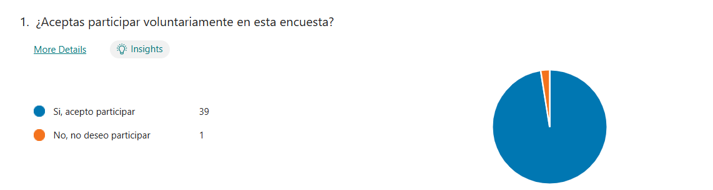
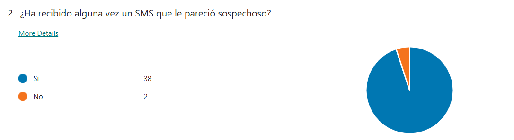
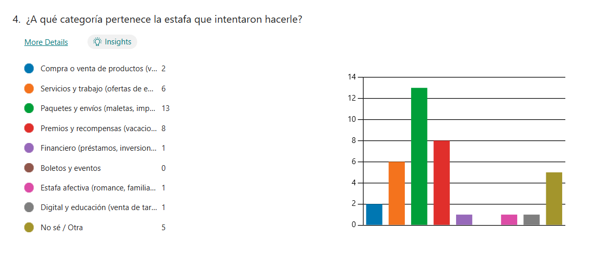
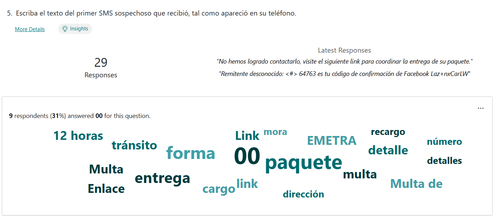
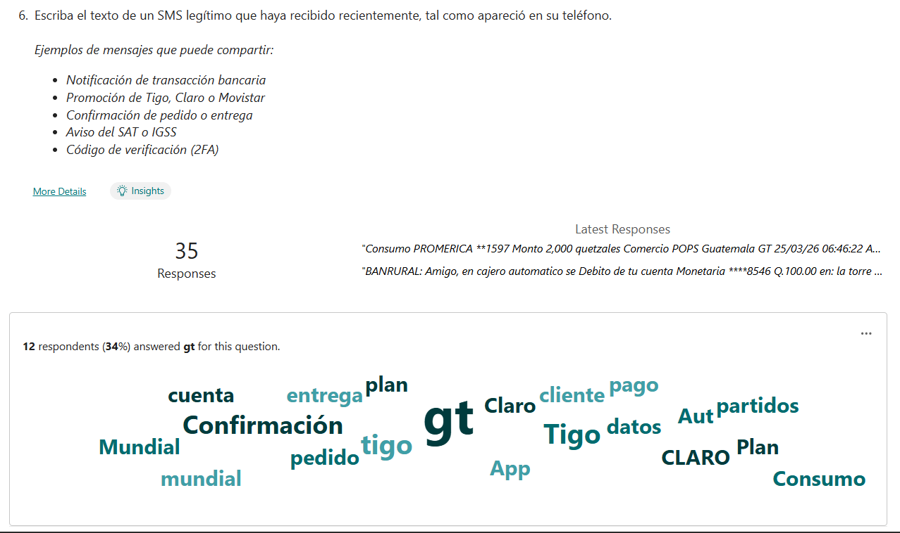
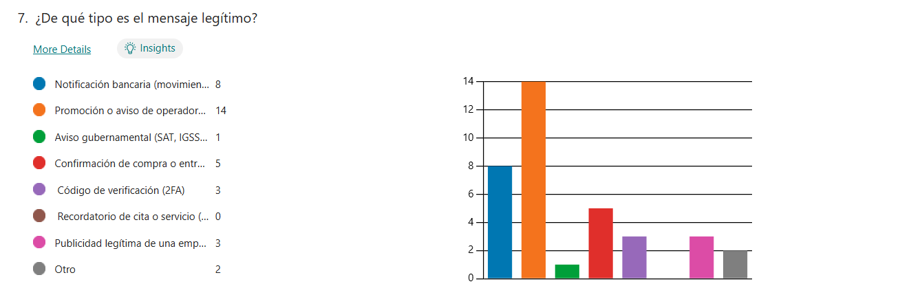
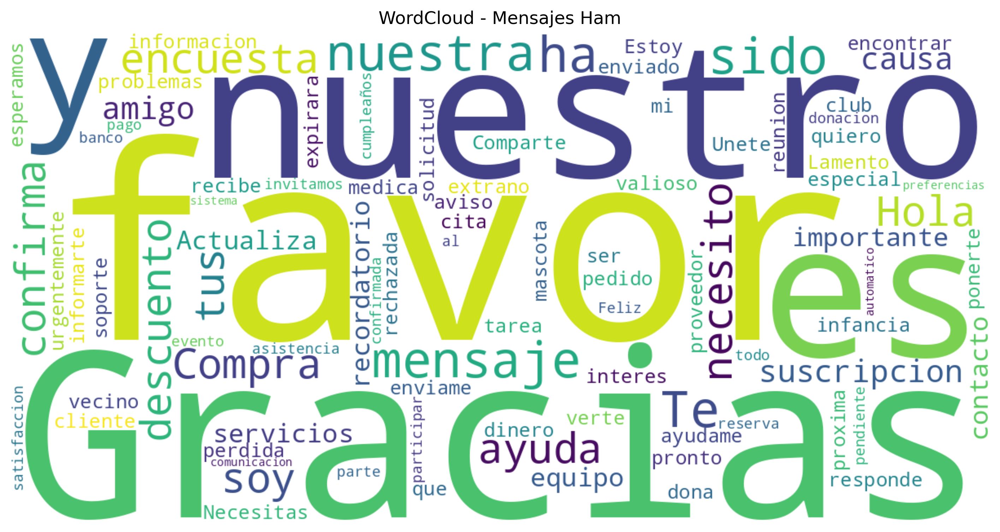
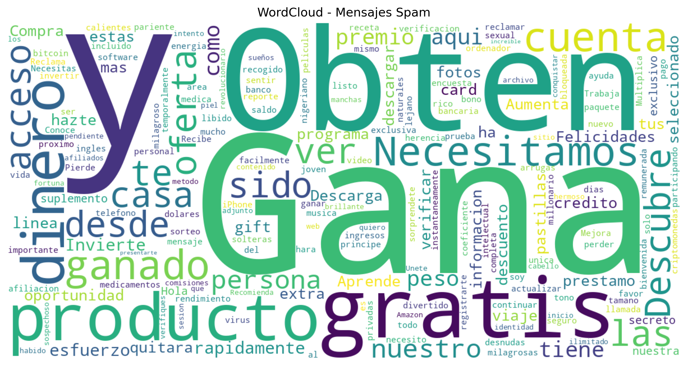

# Fase 1: implementación

## Introducción

Esta investigación busca el desarrollo de un modelo de aprendizaje automático que sea capaz de identificar si un mensaje SMS en Guatemala es malicioso o no haciendo uso de 3 vectores de ataque: 

- El contenido del mensaje
- El emisor del mensaje
- Metadata asociada al mensaje como presencia de URLs, longitud del mensaje, presencia de palabras de ugencia, etc

Sin embargo, en Guatemala no se ha realizado mucha investigación al respecto y no hay datos oficiales o datasets que tengan registro de los mensajes de texto que tengan una intención maliciosa. Tampoco existen bases de datos que contengan mensajes con información legítima como comprobantes de pago, solicitudes código de verificación, etc. Por esa razón, en este informe se enumeran los procedimientos realizados para generar un dataset que contenga esta información

## Parte 1: Obtención de datos

Este tipo de estafas son muy frecuentes en Guatemala, por lo que gran parte de los ciudadanos guatemaltecos han recibido alguna vez un mensaje de texto con intención maliciosa. Por lo tanto, se decidió hacer una encuesta a través de *Microsoft Forms* a una parte de la población guatemalteca en la que se recopila información sobre los mensajes sospechosos o maliciosos que hayan recibido alguna vez, en la encuesta también se pide información de mensajes legítimos como promociones de empresas telefónicas y restaurantes, comprobantes de transacciones bancarias o solicitudes de autenticación. 

*Cabe aclarar que todos los datos recopliados en la encuesta fueron anónimos y que los participantes aceptaron voluntariamente compartir la información de sus mensajes recibidos.* 

La encuesta fue respondida por un total de 40 participantes, de los cuales 39 aceptaron participar voluntariamente.

La encuesta contenía 7 preguntas, a continuación se describe el propósito de cada una de ellas y los resultados obtenidos:

1. Consentimiento de participación

Pregunta:
¿Aceptas participar voluntariamente en esta encuesta?

Posibles respuestas:

Sí
No

Resultados:

<div align="center">
  
  <p><em>Figura 1: Resultados de la primera pregunta de la encuesta</em></p>
</div>

Propósito:
Garantizar que la participación en la encuesta sea completamente voluntaria y cumplir con principios éticos de recolección de datos.

2. Experiencia con SMS sospechosos

Pregunta:
¿Ha recibido alguna vez un SMS que le pareció sospechoso?

Resultados:

<div align="center">
  
  <p><em>Figura 2: Resultados de la segunda pregunta de la encuesta</em></p>
</div>

Propósito:
Determinar la prevalencia de este tipo de mensajes en la población y validar la relevancia del problema en el contexto guatemalteco.

3. Identidad del remitente

Pregunta:
¿De quién decía ser el mensaje?

Resultados: 

<div align="center">
  
  <p><em>Figura 3: Resultados de la tercera pregunta de la encuesta</em></p>
</div>

Propósito:
Identificar los tipos de entidades que los atacantes suelen suplantar, lo cual permite definir características relevantes para el modelo de clasificación.

4. Tipo de estafa

Pregunta:
¿A qué categoría pertenece la estafa que intentaron hacerle?

Resultados: 

<div align="center">
  
  <p><em>Figura 4: Resultados de la cuarta pregunta de la encuesta</em></p>
</div>

Propósito:
Clasificar los distintos tipos de ataques y entender los patrones más comunes utilizados en mensajes maliciosos.

5. Ejemplo de SMS sospechoso

Pregunta:
Escriba el texto del primer SMS sospechoso que recibió.

Respuestas obtenidas:
29 respuestas válidas.

Resultados:

<div align="center">
  
  <p><em>Figura 5: Resultados de la quinta pregunta de la encuesta</em></p>
</div>

Propósito:
Recopilar datos reales para construir el dataset de mensajes maliciosos que será utilizado en el entrenamiento del modelo.

6. Ejemplo de SMS legítimo

Pregunta:
Escriba el texto de un SMS legítimo que haya recibido recientemente.

Resultados:

<div align="center">
  
  <p><em>Figura 6: Resultados de la sexta pregunta de la encuesta</em></p>
</div>

Propósito:
Obtener ejemplos de mensajes legítimos para entrenar el modelo y evitar sesgos en la clasificación.

7. Tipo de mensaje legítimo

Pregunta:
¿De qué tipo es el mensaje legítimo?

Resultados:

<div align="center">
  
  <p><em>Figura 7: Resultados de la séptima pregunta de la encuesta</em></p>
</div>

Propósito:
Categorizar los mensajes legítimos y comprender sus características para diferenciarlos de los mensajes maliciosos.


Los resultados se encuentran en el archivo: [dataset_encuesta.csv](data/dataset_encuesta.csv)

### Análisis de los resultados

Se obtuvieron resultados bastante interesantes y se demostró porque era necesario desarollar un dataset de mensajes de texto legítimos y maliciosos adaptado al contexto guatemalteco pues a pesar de ser una muestra pequeña, vemos que las palabras más utilizadas son muy diferentes a las del dataset de mensajes spam en español de [Hugging face](https://huggingface.co/datasets/softecapps/spam_ham_spanish), en Guatemala el phishing se relaciona más a multas, entrega de productos y dinero (sale el lexema 00) mientras que en el resto del mundo las estafas se centran más on ofrecer algo gratis o ganar un premio. Se puede ver la worldcloud del dataset anteriormente mencionado en la sección de anexos

## Parte 2: Limpieza y generación sintética

### Generación de mensajes de texto

Luego de obtener los datos 

El proceso de limpieza y generación de data sintética se encuentra en: [Generación de datos](src/data_generator.ipynb)

Se realizaron las siguientes operaciones:


- Separar el dataset en 2 partes : una con los mensajes maliciosos introducidos en el 5to campo de la encuesta y la otra con el resto de mensajes, conservar solo la categoría (intoriducida en los campos 7 y 4 de la encuesta ) de cada mensaje.

- Una vez separado, crear el campo *tipo* el cuál indica si un mensaje es malicioso o no. 

- Una vez que ambas partes tiene la misma estructura, concatenar ambos dataframes. El resultado de esta operación puede verse en el archivo: [dataset_tranformed.csv](data/dataset_tranformed.csv)

Se obtuvieron 40 resultados, sin embargo para entrenar un modelo se necesita una mayor cantidad de información. Por esa razón se uso la API de *Google Gemini* con el modelo *Gemini 3 Pro Preview* con el siguiente prompt:

```python

    prompt = f"""
Eres un experto en ciberseguridad guatemalteco analizando SMS fraudulentos.

Dado este mensaje SMS original:
- Texto: "{row['Mensaje']}"
- Tipo: "{row['tipo']}"
- Categoría: "{row['Categoria']}"

Genera exactamente 8 variaciones sintéticas que:
- Mantengan la misma etiqueta ({row['tipo']}) y categoría ({row['Categoria']})
- Usen instituciones guatemaltecas reales (EMETRA, SAT, Banrural, BAM, IGSS, Tigo, Claro, Renap, Migración)
- Usen español guatemalteco natural (mezcla de vos/usted según contexto)

{"Para variaciones SPAM (fraudulentos): Variar nivel de urgencia (mayoría sutil), incluir URLs falsas (.icu, .xyz, .info, .tk, bit.ly), variar montos entre Q150 y Q5,000" if row['tipo'] == 'spam' else "Para variaciones HAM (legítimos): NO incluir URLs sospechosas, mantener tono formal e institucional, variar montos, fechas y detalles menores"}

Responde ÚNICAMENTE con un array JSON válido con exactamente 8 objetos, sin texto adicional:
[
  {{
    "texto": "texto completo del SMS",
    "categoria": "{row['Categoria']}",
    "tipo": "{row['tipo']}"
  }}
]
"""

```

Se le especifico al modelo que a la hora de generar mensages de tipo spam no usuara un tono que relfejara urgencia, pues la worldcloud de los resultados de la encuesta mostró que los mensajes maliciosos no usan palabras como *Alerta*, *Urgente* para generar miedo en el receptor del mensaje, si no que más bien se usan palabras como *Multa*, *Mora*, *Recargo* . Se le pidió generar al menos 8 variaciones por mensaje para obtetner una muestra de más de 500 mensajes para entrenar el modelo. 

Los mensajes generados sintéticamente se encuentran en el archivo: [dataset_sintetico.csv](data/dataset_sintetico.csv) y el dataset con los mesajes reales y sintéticos unificados se encuentra en el archivo: [dataset_smishing.csv](data/dataset_smishing.csv)

### Generación de whitelist

Finalmente, se le solicito al modelo *Claude 4.6 Sonet* con el MCP de búsqueda en internet que encontrará los números de teléfono de las instituciones bancarias, operadoras telfónicas, empresas de paquetería y cadenas de restaurantes más famosas en Guatemala y en base a los resultados de la búsqueda generar una whitelist. Los resultados se encuentran en el archivo: [whitelist.csv](data/whitelist.csv)


## Parte 3 

## Anexos

1. 
<div align="center">
  
  <p><em>Figura X: Worldcloud de los mensajes legítmos dataset de mensajes de SPAM de Hugging Face </em></p>
</div>

2. 

<div align="center">
  
  <p><em>Figura X: Worldcloud de los mensajes legítmos dataset de mensajes de SPAM de Hugging Face </em></p>
</div>
